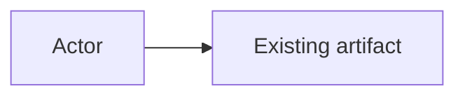
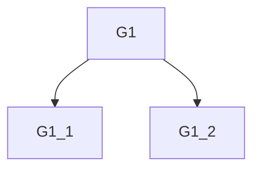

# Requirements — <working name>

**Customer statement (verbatim).** <paste the informal problem; do not polish>

**Status.** Draft for user review | Accepted <date> | Revised <date>

**This version vs later vs not at all.** One line: what this version is for.

---

## 1. Environment model

Simplified model of the world the system sits in. Not a design of the system.

### Actors

| Actor | Definition |
|---|---|
| | |

### Concepts (vocabulary)

| Term | Definition | Notes |
|---|---|---|
| | | one term per concept |

### Existing artifacts

| Artifact | What it already is |
|---|---|
| | |

### Relationships

- <A> is part of <B>
- <A> depends on <B>

### Invariants

- <fact that must remain true whether or not the new system exists>

---

## 2. Goals and required functions

User terms. Leaves defined with the vocabulary above.

### Hierarchy

- **G1** <high-level goal>
  - **G1.1** <more specific>
  - **G1.2** <leaf: observable in the environment>
- **G2** …

### Functions the system must perform

Leaves that are actions, still in user terms.

| ID | Function | Defined in terms of |
|---|---|---|
| F1 | | concept / actor / artifact |

### Negotiation

| ID | This version | Later | Not at all |
|---|---|---|---|
| G1.2 | x | | |

---

## 3. Performance constraints

Runtime limits on the *system*. `none stated` if the customer did not give any; list assumptions separately.

| Constraint | Measure | Bound | Source |
|---|---|---|---|
| | time / memory / downtime | | stated / unstated→proposed |

---

## 4. Implementation constraints

Environment, form, and methods.

| Type | Constraint | Source |
|---|---|---|
| Environment | hardware, OS, external systems | |
| Form | language, coding standards, docs | |
| Methods | tools, tests, benchmarks | |

---

## 5. Resource constraints

Limits on the *development project*.

| Constraint | Bound | Source |
|---|---|---|
| Schedule | | |
| Budget | | |
| People / agent-time | | |

---

## 6. External interfaces

Boundaries only. No payloads, wire formats, or layouts.

| Interface | Counterpart | Purpose | Direction |
|---|---|---|---|
| | actor or existing artifact | what crosses | in / out / both |

---

## Unstated requirements

Discovered by the analyst. Not in force until the customer accepts.

| Item | Class | Proposed requirement | Customer |
|---|---|---|---|
| | computer-motivated / familiar | | accept / later / reject / pending |

---

## Consistency and review

- **Defined terms.** Every term in a leaf goal appears in §1.
- **Conflicts.** None, or listed here (unresolved → do not implement).
- **Blocking questions asked.** None, or listed here with the customer's answer. The record was not written while these were open.
- **Implications presented to the customer.** What becomes true; what this version will not do; assumptions promoted from silence.
- **Customer judgment.** Pending | accepted | changes requested
